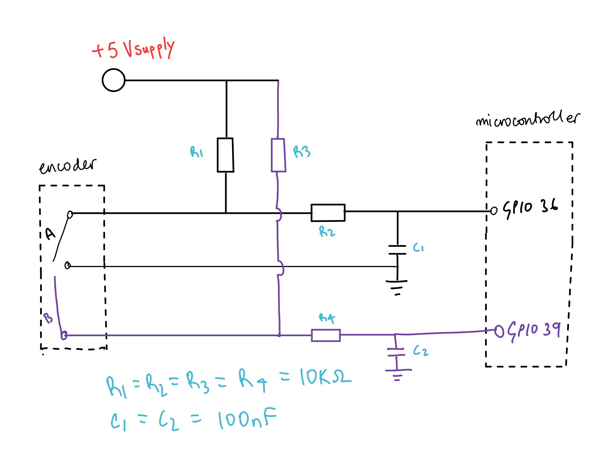

# RotaryEncoderForAutonomousEEEBot
Using the PEC12-R to track distance on a autonomous vehicle. Peforming manoevers like: a figure of eight or a tight U-turn.

## Project context and motivations
In my first year i wasn't able to go into depth with using the encoders. We had a challenge at the end of the first project week to travel accuartely 10 meters in the main hall.My solution was to just have a delay() which is eqivalent to 10 meters but this doesn't take into account different floor textures so, my solution was crap. there was additional challeneges like the figure of eight which would set the foundation for latter project weeks which involved parking and peforming certain manovers

I decided to revisit this during my gap year (2025-2026) before i come back for my final 3rd year (2026-2027) and plug some holes and dust off some rust.

 Initially, my code was simple trying to figure out how to use the motors how to set the speeds then, moved onto tracking the the encoder signals. From looking at oscillioscope readings and comparing what the datasheet said about what the signals should look like, i came to the conclusion that  the encoders are very cheap and not the best so i needed to address that in my code.
 
 
 Another problem was me not understanding how fast the microcontroller loops through the code and becuase the encoders are cheap this will be a big problem. Any type of movement or shaking would trigger the encoders which would record these anomolous values and not give me accurate readings. Im not going to lie to you, i put this through ai and it came up with something called a debounce counter so it gave me the skeleton code, implemented it. Quite simple, if the wheel rotated it would need to check whether it stayed at that position for a consecutive amount of readings and only then it would register that as a movement. Quite clever, the satisfaction wasn't as good becuase i didnt figure it out but i made it work. I'm not here to reinvent the wheel.
 
 
In my second year i was introduced to object orientated programming (OOP) in cpp which i found quite difficult at the time, the syntax was okay it was just when will i use this? going back to this, this was such an obvious solution to making the car do a figure of eight and making it look good and logical in the code but, me in first year would never in a million years think to do that; anyway...

Finally, like i mentioned, how can i logially write some code which makes the vehicle do a figure of eight, turn right,left etc... (OOP!!!). Adding the other encoder then making both enocders work together using the same matrix look up table. I found it quite difficult managing so much at once making sure it all work whilst doing all the checks so it doent give me trash. I'm still quite suprised, how much better something can be from the simple switch case and also how much you can do with just an encoder which has 2 signals, Crazy.

## V1.0 Switch case: a full encoder circuit assumptions and behaviours , The concept, the code and justification, faliures and workarounds 

# The circuit: a full encoder circuit assumptions and behaviours 
The first circuit below is what one encoder looks like it has 2 channels a and b which are essentially switches which are controlled by rotating the encoder --> metal contacts touch --> closes switch --> metal contacts disconnect --> switch opens.

the microcontroller pins gpio 36 and 39 in my circuit analysis will be treated as though they are open circuits so, current cannot flow into it. You can think of it as an op amp golden rule.

the capacitors(c1,c2) which forms the rc filter wil be treated as if it was in the steady state (ss) and not the tranient state when the switching states are high or low respectivley so, in ss the cap will be fully charged or discharged,no current will be able to flow through this and into gnd, i will talk about the capacitor in the transient state later. 

  

