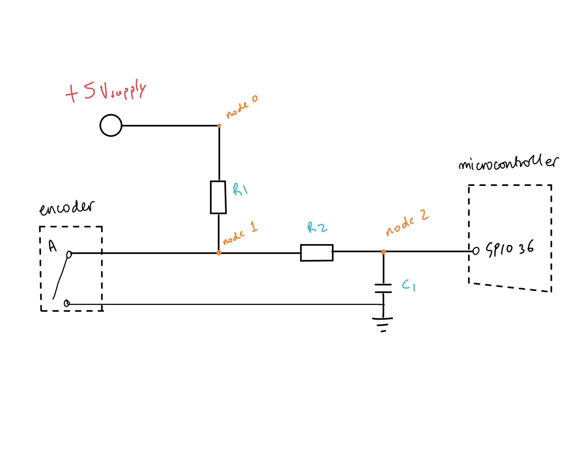
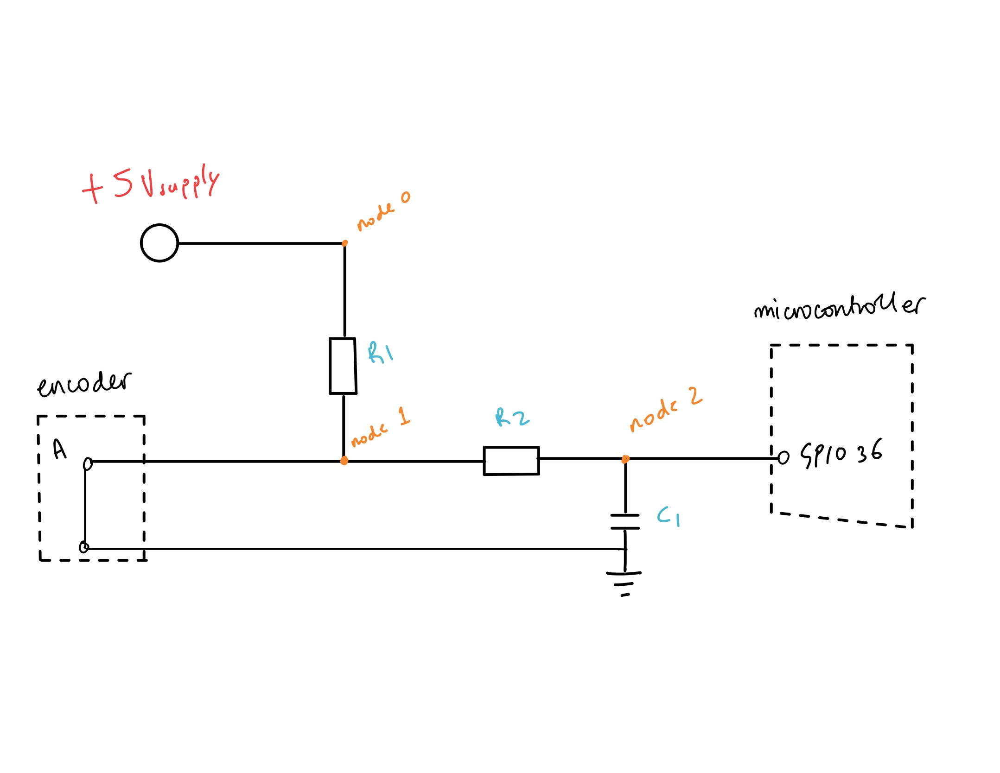
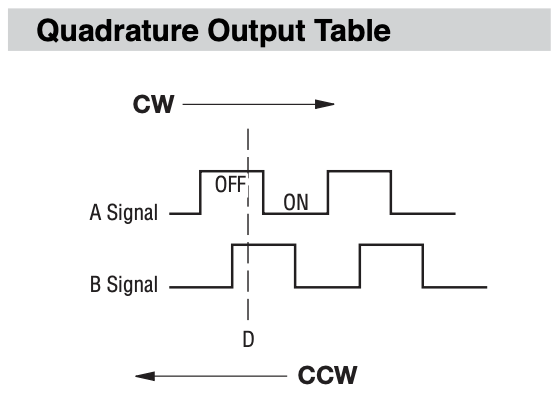
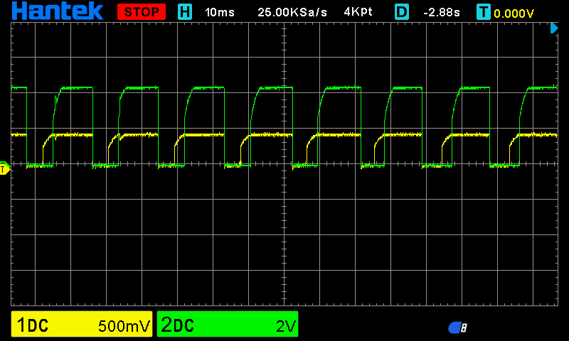
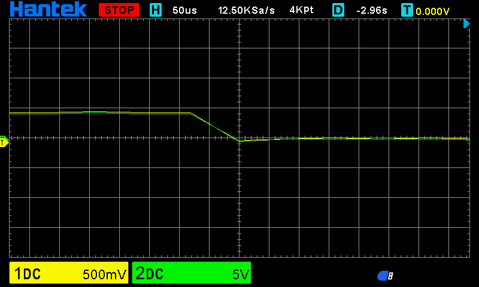

# RotaryEncoderForAutonomousEEEBot
Using the PEC12-R to track distance on a autonomous vehicle. Peforming manoevers like: a figure of eight or a tight U-turn.

## Project context and motivations
In my first year i wasn't able to go into depth with using the encoders. We had a challenge at the end of the first project week to travel accuartely 10 meters in the main hall.My solution was to just have a delay() which is eqivalent to 10 meters but this doesn't take into account different floor textures so, my solution was crap. there was additional challeneges like the figure of eight which would set the foundation for latter project weeks which involved parking and peforming certain manovers


I decided to revisit this during my gap year (2025-2026) before i come back for my final 3rd year (2026-2027) and plug some holes and dust off some rust.


 Initially, my code was simple trying to figure out how to use the motors how to set the speeds then, moved onto tracking the the encoder signals. From looking at oscillioscope readings and comparing what the datasheet said about what the signals should look like, i came to the conclusion that  the encoders are very cheap and not the best so i needed to address that in my code.
 
 
 Another problem was me not understanding how fast the microcontroller loops through the code and becuase the encoders are cheap this will be a big problem. Any type of movement or shaking would trigger the encoders which would record these anomolous values and not give me accurate readings. Im not going to lie to you, i put this through ai and it came up with something called a debounce counter so it gave me the skeleton code, implemented it. Quite simple, if the wheel rotated it would need to check whether it stayed at that position for a consecutive amount of readings and only then it would register that as a movement. Quite clever, the satisfaction wasn't as good becuase i didnt figure it out but i made it work. I'm not here to reinvent the wheel.
 
 
In my second year i was introduced to object orientated programming (OOP) in cpp which i found quite difficult at the time, the syntax was okay it was just when will i use this? going back to this, this was such an obvious solution to making the car do a figure of eight and making it look good and logical in the code but, me in first year would never in a million years think to do that; anyway...


Finally, like i mentioned, how can i logially write some code which makes the vehicle do a figure of eight, turn right,left etc... (OOP!!!). Adding the other encoder then making both enocders work together using the same matrix look up table. I found it quite difficult managing so much at once making sure it all work whilst doing all the checks so it doent give me trash. I'm still quite suprised, how much better something can be from the simple switch case and also how much you can do with just an encoder which has 2 signals, Crazy.


# V1.0 Switch case: 
# - full encoder circuit assumptions, half encoder circuit explanation and analysis
# -  The concept, early problems & pseudo-code
# -  the V1.0 Code faliures, debugging, work-arounds 

# The circuit: a full encoder circuit assumptions 
The first circuit below is what one encoder looks like it has 2 channels a and b which are essentially switches which are controlled by rotating the encoder --> metal contacts touch --> closes switch --> metal contacts disconnect --> switch opens.


the microcontroller pins gpio 36 and 39 in my circuit analysis will be treated as though they are open circuits so, current cannot flow into it. You can think of it as an op amp golden rule.


the capacitors(c1,c2) which forms the rc filter wil be treated as if it was in the steady state (ss) and not the tranient state when the switching states are high or low respectivley so, in ss the cap will be fully charged or discharged,no current will be able to flow through this and into gnd, i will talk about the capacitor in the transient state later. 


<p align="center">
  
</p>

# The circuit: half an encoder circuit explanation and analysis
It's much easier to understand what one side of the circuit does becasue, the other side does the exact same thing but is a step behind or ahead depending on if the encoder is going forwards or backwards. 


# Encoder circuit switch A is open 


<p align="center">
  
</p>


I will explain what the condtions where before the switch was opened the instant thats it was opened (transient) and after it was opened (steady state). 


## before it was opened:

( you have to trust that these where the conditions without looking to deeply into this, it will make sense once i explain both open and closed encoder switch)


- The capacitor is fully discharged 


- the current was flow: +5V --> node 0 --> through R1 --> node 1 --> GND 


- the microcontroller at node 2 was seeing 0V which means that the signal was LOW, 0 or 0V


## The instant that encoder switch is opened : (TRANSIENT)

- Current flow +5V --> node 0 --> through R1 --> node 1 --> through R2 --> node 2 --> charging c1 --> GND


- the time constant of the capacitor = R1 * R2 * C1 

-  in the encoder it usually is a spring which contacts the metal. This induces vibrations which will cause the voltage to oscillate for a few microseconds before settling down for its intended state. This is prevelant in all encoders but can be mitigated through the use of gold contacts or a better spring constant of the spring used. So to summaries the encoder will bounce between 0V and 5V, between state switch on and state switch off. This causes the transients/ noise. This is called CONTACT BOUNCE.


The micocontroller processes instruction at a rate of 240MHz so it will register every single switch state change which could cause erratic behaviour when it comes to tracking the distance travelled.


WITHOUT a capacitor node 2 will bounce up and down untill it settle. this will cuase the noise and will ruin the tracking. WITH a capacitor the voltage spikes will be smoothed out which the microcontroller can interpret as a rising edge. the frequency of the spike will be faster than the time it takes to charge the cpacitor (this will be explained in depth below).


Time consant of the cap:
defined by: tau = r*c ==> tau = R1*R2*C1 and for charging capacitor 1 tau = 63% charge of the cap im not going into the maths here


It takes about 5 * tau for a complete charge discharge


- if tau << frequency of oscillation 0V to 5V:


cap charges and discharges instantly so there is no smoothing


- if tau == frequency of oscillation 0V to 5V:

the voltage at node 2 becomes wobbly at at a median value like 2.5V which is no good for a microcontroller which has thresholds for what it considers as high or low 


- if tau > frequency of oscillation 0V to 5V:

The capacitor is slightly too slow(5ms) to react to the individual spikes (50us changes). this means that the voltage is averaged out which is what i need. 

- if  tau >> frequency of oscillation 0V to 5V: The capacitor will take too long to charge / discharge so the signal will change in real time but the cpacitor is taking too long hence there will be data lost.


## The encoder switch is open (STEADY STATE):


- To reiterate, ther current can't flow through the encoder becuase the switch is opened. The current can't flow through the capacitor anymore becuase the voltage at is no longer bouncing so no current flows to the gnd through the cap ( I = C*dV/dt) and the assumption we had that the microcontroller is treated a if it is an open circuit means that anywhere on the circuit the voltage is 5V becuase no current can flow. The microcontroller sees this and at node 2 the voltage is 5V therefore, the signal is high.


# summary : when the encoder switch is open, signal A = high

# Encoder circuit switch A is closed


<p align="center">
  
</p>


Now that i have disscused the open circuit the conditions before the switch was closed makes more sense now.


## before encoder was closed:

it must've been open so: 

- capacitor is fully charged 

- no current is flowing through the circuit 

- same microcontroller assumption that its a open circuit from node 2 to microcontroller but, because the switch is open signal A = high


## the instant the encoder was closed (TRANSIENT)


- Current flows: +5V --> node 0 --> through R1 --> node 1 --> through ENCODER --> GND


- because the capacitor is fully charged it starts to discharge through R2 only and that node 1 is connected to GND hence,
tau = R2*C1

- microcontroller as disscused in the open case sees the signal start to bounce, the capacitor smooths the signal  


## The encoder switch is closed (STEADY STATE):

- c1 has now fully discharged, becuase the current is only flowing from node 1 to gnd through the encoder. Node 2 now becomes 0V hence signal A = low as seen from the microcontroller.

## why is the pull-up resistor(R1) needed here?

- if there was no resistor for the closed case that would mean that the current going from the supply to the gnd through the encoder would be infinite (I = V/R, R = 0) but, in reality this would trigger the current limiter protection or burn through your components

- it also serves a purpose of being part of the reistance which form the calculation for the time constant for the open switch version of the circuit


# summary : when the encoder switch is open, signal A = low


# -  The concept & pseudo-code


## The Concept, early problems

The way the signal A and B interact is how this encoder works. Below, there is a diagram which features what the signal should look like when turning the wheel clockwise and anti-clockwise.

<p align="center">
  
</p>


So if the encoder is going forwards ( clockwise ) the signal will be as follows:

Assuming we are starting at Signal A = 0 Signal B = 0

|  Signal A  |  Signal B  |

|     0      |     0      |

|     1      |     0      |

|     1      |     1      |

|     0      |     1      |

|     0      |     0      |

it then repeats. if i wanted to go backwards then the cycle is reversed

Below are the ocilliscope readings where it shows what the actual signal looks like:

<p align="center">
  
</p>

ignore the voltage levels this is a problem with the oscilliscope both voltages are the same i tested it by switching the probes around on the actual scope and the values switch.

But the main this to look at is the during SignalA = 0 & SignalB = 1 THIS STATE DOESNT EXIST i did a zoom in on the actual readings and this is it below:


<p align="center">
  
</p>

this is too fast and impossible for the microcontroller to know that this should be SignalA = 0 & SignalB = 1. in V1 of the code i didnt realise but, in V2 i took note of it.


##State diagram 

so basic concept, ill need to package these 2 signals into 1 variable and then create 4 variables which have to go into a certain order so originally i thought of using a bunh of if statements with conditions being just the signals and also initially establishing what the signals was before moving off it could be any of the 4 variables this is the breakdown of it below:


|   state   | Signal A  |  Signal B  |

|     0     |    0      |     0      |

|     1     |    1      |     0      |

|     2     |    1      |     1      |

|     3     |    0      |     1      |

|     0     |    0      |     0      |


// defining which state im in before moving off

if (signala == 0 && signalb == 0 ){
    
    current_state = s0
}
so on....

### I establish what state im currently starting in 

void loop{

read the signal a and b at this current moment


switch(this is the main variable 'currentState' which dynamically changes'){
    
    case test_variable:
    // if the main variable is the same as the test_variable the code below executes
    /* code to be executed*/
    break; // end of the line of code to be executed exits the switch case

}

## focus on the next point i'll say

so from the state diagram we have :


|   state   | Signal A  |  Signal B  |

|     0     |    0      |     0      |

|     1     |    1      |     0      |

|     2     |    1      |     1      |

|     3     |    0      |     1      |

|     0     |    0      |     0      |


becuase we can only go clockwise and anti-clockwise.If i'm in state 3 the only states that i can go to next is state 2 if im going backwards physically the wheel is spinning anti-clockwise or state 0 is i'm going forwards. This works for all states in V1 but in V2 the code is updatd for the impossible state which doesnt exist for now i included it in the code.So, the code will look like this:


```cpp 
Example code snippet switch-case

int LeftEncoderPulseCount (int leftSignalA, int leftSignalB){

      switch(currentState){
        case S0:                                    //currently start at S0
         if(leftSignalA == 1 && leftSignalB == 0){
           currentState = S1;                          // MOVE TO NEXT STATE
          pulseCount ++;
          Serial.print("Pulse count: ");                              //mealy machine output
          Serial.println(pulseCount);                 // printing mealy machine output
         }
       else if(leftSignalA == 0 && leftSignalB == 1) {
        currentState = S3;                            //backwards movement
       }
       break;
       
    return pulseCount;
}

```
i've noticed a bug but there should be a decrement pulse count if im going backwards but that tis the gist of the code. then using the pulse count i can calculate the distance becuase i know that from the encoder datasheet:


- so i can now measure if the car goes forward and backwards now i need to do some maths:

    circumfrence of a circle = 2*pi*radius
    from testing, marking it at top dead center and rotating the wheel so it gets back to the same spot, how many pulses?
    
    1 revolution = 10 pulses
    
    10 pulses = 2*pi*3.1
    
    1 pulse distance = (2*pi*3.1)/10
    
    1 pulse dist = (pi*3.1)/5 
    
    hence,
    
    target pulse count = input distance/ 1 pulse dist
    
    then fromt he switch case i update the count for every movement forwards 
    
    
    in main loop 
    
    switchcase
    return pulsecount
    
    go forwrds 
    
    if pulsecount > target pulse count 
    
    stop 
    
   pretty simple so understand i'll provide the full code so that it makes sense 
   
 
 
<details>
<summary>🔻 <b>Click to expand V1.0 Baseline Code (Mealy State Machine)</b></summary>

<br>

```cpp

#define enA 33  // Enable A command line
#define enB 25  // Enable B command line

#define INa 26  // Channel A Direction
#define INb 27  // Channel A Direction
#define INc 14  // Channel B Direction
#define INd 12  // Channel B Direction

#include <math.h>

const int ledChannela = 0;
const int ledChannelb = 1;
//gpio pins used for left motor
const int leftmotorChannelaPin = 36;
const int leftmotorChannelbPin = 39;

int i = 0;
int leftSignalA = 0;
int leftSignalB = 0;
int pulseCount = 0;

//enum assigns variables to numbers but it is always starts with 0 then 1 so on..
enum States {S0 = 0, S1 = 1, S2 = 2, S3 = 3};
States currentState;
//define single pulse distance IN CM
const float singlePulseDist = (M_PI*3.1)/5;
//Input distance wanted into this variable IN CM
const int InputDist = 38;

void setup() {

  //conffiguring encoder pins as inputs
  pinMode(leftmotorChannelaPin,INPUT);
  pinMode(leftmotorChannelbPin,INPUT);
  
  // Configure motor direction pins as outputs
  pinMode(INa, OUTPUT);
  pinMode(INb, OUTPUT);
  pinMode(INc, OUTPUT);
  pinMode(INd, OUTPUT);

  // Attach PWM channels to pins
  ledcAttachPin(enA, ledChannela);
  ledcAttachPin(enB, ledChannelb);

  // Initialize PWM channels
  ledcSetup(ledChannela, 1000, 8); // 1000 Hz PWM, 8-bit resolution
  ledcSetup(ledChannelb, 1000, 8); // 1000 Hz PWM, 8-bit resolution

  //define a cuurent state depending on real position of encoder and also reaidng it just once before it starts 
  leftSignalA = digitalRead(leftmotorChannelaPin);
  leftSignalB = digitalRead(leftmotorChannelbPin);
  if(leftSignalA == 0 && leftSignalB == 0){
    currentState = S0;
  }
  else if(leftSignalA == 1 && leftSignalB == 0){
    currentState = S1;
  }
  else if(leftSignalA == 1 && leftSignalB == 1){
    currentState = S2;
  }
else{
  currentState = S3;
}
  // Begin serial communication
  Serial.begin(115200);
  Serial.println("ESP32 Running"); 
}

void loop() {
  leftSignalA = digitalRead(leftmotorChannelaPin);
  leftSignalB = digitalRead(leftmotorChannelbPin);
  //Serial.println(singlePulseDist);

  //Serial.print("LeftMotor Channel A : ");
  //Serial.println(leftSignalA);

  //Serial.print("LeftMotor Channel B : ");
  //Serial.println(leftSignalB);
  LeftEncoderPulseCount(leftSignalA,leftSignalB);

  goForwards();
  // Add a delay or other functions to control when directions change or stop
  DistanceCalculator (pulseCount);

  
}

void goForwards() {


  // Set motor direction for forwards movement
  digitalWrite(INa, LOW);
  digitalWrite(INb, HIGH);
  digitalWrite(INc, HIGH);
  digitalWrite(INd, LOW);


  // Set speed (duty cycle) for both motors
  ledcWrite(ledChannela, 90); // Full speed for motor A
  ledcWrite(ledChannelb, 90); // Full speed for motor B

  //delay(1000); // Example delay - adjust as needed for your application

  // You might want to add code here to stop the motors after moving forward
}

void Stop() {
  // Set motor direction for forwards movement
  digitalWrite(INa, HIGH);
  digitalWrite(INb, LOW);
  digitalWrite(INc, LOW);
  digitalWrite(INd, HIGH);
  // Set speed (duty cycle) for both motors
  ledcWrite(ledChannela, 100); // Full speed for motor A
  ledcWrite(ledChannelb, 100); // Full speed for motor B
  delay(60);
  digitalWrite(INa, HIGH);
  digitalWrite(INb, LOW);
  digitalWrite(INc, LOW);
  digitalWrite(INd, HIGH);
  // Set speed (duty cycle) for both motors
  ledcWrite(ledChannela, 0); // Full speed for motor A
  ledcWrite(ledChannelb, 0); // Full speed for motor B
  delay(100000000);
  Serial.print("Distance travelled/cm : ");
  Serial.println(InputDist);
}

void DistanceCalculator (int pulseCount){
  int NumOfPulses = (InputDist-10)/singlePulseDist;       //19cm is the distance from the back to the front wheels to take into account that the back wheels will be set back 
  if(pulseCount>NumOfPulses){
    Stop();
  }
}

int LeftEncoderPulseCount (int leftSignaA, int leftSignalB){

      switch(currentState){
        case S0:                                    //currently at S0
         if(leftSignalA == 1 && leftSignalB == 0){
           currentState = S1;                          // MOVE TO NEXT STATE
          pulseCount ++;
          Serial.print("Pulse count: ");                              //mealy machine output
          Serial.println(pulseCount);                 // printing mealy machine output
         }
       else if(leftSignalA == 0 && leftSignalB == 1) {
        currentState = S3;                            //backwards movement
       }
       break;
    
        case S1:
        if(leftSignalA == 1 && leftSignalB == 1){
          currentState = S2;
          pulseCount ++;
          Serial.print("Pulse count: ");
          Serial.println(pulseCount); 
        }
        else if(leftSignalA == 0 && leftSignalB ==0){
          currentState = S0;                        // backwards movement
        }
        break;
      
        case S2:
        if(leftSignalA == 0 && leftSignalB == 1){
          currentState = S3;
          pulseCount ++;
          Serial.print("Pulse count: ");
          Serial.println(pulseCount); 
        }
        else if(leftSignalA == 1 && leftSignalB == 0)
        currentState = S1;                          // backward movement
        break;

        case S3:
        if(leftSignalA == 0 && leftSignalB == 0){
          currentState = S0;
          pulseCount ++;
          Serial.print("Pulse count: ");
          Serial.println(pulseCount);
        }
        else if (leftSignalA == 1 && leftSignalB == 1){
          currentState = S2;                        //backwards
        }
        break;
      }
      return pulseCount;
}
    
```

    
# V2.0 Look Up Table(LUT) Matrix Solution : 
# - Post Mortem
# - Design Improvements
# - V3.0 Object Orientated Programming (OOP!!!) 
    ## - why was it added ?
    ## - tests & verification
    
    
# Post-Mortem 


The hardware is staying the same but, the problems for the switch case are as follows:

 -  In the code, if the car goes backwards the motion is not accunted for because i don't have a pulseCount-- (decrement). I found that in the code whilst doing this write up 
 
 - Because of the above and also a big problem which involves the mechanical encoder vibrating between changing states and VIBRATING. pulseCount is being calculated and im not getting a constant distance on every single run, the actual precision is poor
 
 - The signal change from signal A = 1 & signal B = 1 --> signal A = 0 & signal B = 1 --> signal A = 0 & signal B = 0 from the datasheet misses the signal A = 0 & signal B = 1 state so the actual signal i see 
 
 
  signal A = 0 & signal B = 0 --> signal A = 1 & signal B = 0 --> signal A = 1 & signal B = 1 --> back to the front( if going forward )
    
- the actual structure of the software is flawed and is not good for continual improvements for later developers or myself. Including more duplicates of if and switch cases for the other encoder seemed long which meant that it probaly took longer for the cpu to execute becsuse there could be multiple N branches to go through. the readability would improve since i would only need to declare the matrix once to memory. The noise/the voided state can be eliminated if i just set that to 0 but keep it in the code for completness.


    
    i had ai give me and overview of how i can code this during my v1.0 stage but it required more complexity so i decided to code the first one with if statements and then improve by using the LUT which is considered the gold standard in embedded software


# - Design Improvements


- i'll break down the LUT implementation and how the indexing works 

- since we are needing this to be generated once i put this into setup which only runs once, this creates an 2d array [4x4] where the top left element is 0,0 becuase this is still an array the comments show what the signal a&b correspond to the value allocated

```cpp
void setup{

const int encoderTable[4][4]={
    /*New states      00,  01, 10, 11*/
    /*old state 00*/{  0,  0,  1,   -1},
    /*old state 01*/{  0,  0,  0,   0 },
    /*old state 10*/{ -1,  0,  0,   1 },
    /*old state 11*/{  1,  0, -1,   0 }       
};  

}
```


-  looking at this encoderTable[x][y] --> encoderTable[old state][new state] , its the same concept as the switch case but in a 2d matrix


- if are going forward from V1.0 code we go from:
    
    State 0 (signal a = 0 b = 0) --> State 1 (signal a = 1 b = 0) --> State 2 (signal a = 1 b = 1) --> State 0 ( because State 3 does'nt exist). 

each state is made up from a signal value A and B so i need a way to combine these variables which are constatntly changing into an index. drum roll.......Bitwise operation.

## - Bitwise Operation concept 

so i need 1 variable (an index) to control the LUT but i have 2 signals a and b which read the data. 

lets say we have signal a = 1 and b = 0, i i can use the | (or operand) to put these two bits together to form 1 byte 

bit wise opperand >> left shift shifts the signal A left by n bit (signal a *2^n)

so instead of having both of these in the same bit collumn 0 we have the signal b in 0 and the signal a in 1

i think this is quite a bad explanation but you just have to accept that the bit shift to the left by 1 and that both of these signals cant affect eachother but then when we glue both of these signals together what is the output?

because this is bit shifted and i am using an or the or gate's output is true/false and condenses both the signals but the shifted bitwise byte represents the binary value so 


|   state   | Signal A  |  Signal B  |    binary value    |

|     0     |    0      |     0      |         0          |

|     1     |    1      |     0      |         2          |

|     2     |    1      |     1      |         3          |

|     3     |    0      |     1      |         1          |

|     0     |    0      |     0      |         0          |


so from this its quite easy to be confused as to why the states dont match up with the numbers but when i was debugging i woud need to see 0 --> 2 --> 3 --> 0 if i was going forward and this worked like a charm now back to the LUT.


# LUT

i used a 2d matrix array fot the look up table this is a much cleaner solution to branches of if else statements which makes the code more readable. the code if it has if else branches doesnt have to evaluate N branches untill its the statement is true the LUT always has the same clock cyccles regardless of direction of the wheel spinning and state.


avoids copy and paste logic wen integrating the other encoder in V3.0, it reuses the same LUT Saves memory space. Also for my dead state of Signal A = 0 Signal B = 1 which doesnt occur in my encoders i can just set that value to 0 in the matrix table which will eliminate any electrical chatter.

i used bitwise operation here to combine both the signal a & b so that it can be a index.


```cpp

  //  Map pins to matrix state index
  currentStateNum = (leftSignalA << 1) | leftSignalB;  

```
for the leftsignal all it does is shift the bit to the right ( equivalent to multiplying by 2^1 ) and the OR will just glue the signal b to the shifted left signal both signasl will never interrupt.


# debounce filter 

Even with the the precise allocation of the tau values which masks the high frequency bouncing of the encoders mechanical switch there is still some bouncing which occured which deviates my value for pulse count. For precise movements using my encoders this was giving me poor accuracy.

the the debounce filter will act like a bouncer at a club if teh bouncer sees that your moving side to side erratically he wont let you in the club. if the bouncer sees you checks your id and your not swaying side to side he will let ypu in the club.


now to put it more technically there is a thershold for how long you have to stay still for before you can eneter the club.


first we start off with the decounce counter at 0 and set the thershold to 6 so the value will need to stay the same for 6 consecutive cycles before i can get a value from the matrix which will then determine if the pulse count goes up down or stays the same.

The initial start up state

``` cpp

  if(leftSignalA == 0 && leftSignalB == 0)      { currentState = S0; previousStateNum = 0; }
  else if(leftSignalA == 1 && leftSignalB == 0) { currentState = S1; previousStateNum = 2; }         
  else if(leftSignalA == 1 && leftSignalB == 1) { currentState = S2; previousStateNum = 3; }         
  else                                          { currentState = S3; previousStateNum = 1; }          

  //initialises what the state is at the start for the debounce filter
  stableStateNum = previousStateNum;

```

reading the values 

``` cpp

  //  Map pins to matrix state index
  currentStateNum = (leftSignalA << 1) | leftSignalB;  
  
  ```

if the state is the same as we read in the previous cycle then nothing happens 
if it changes we increase the count by 1 exit the loop read again its tnot the same increase by 1 exit loop read again...Evantually i reach the threshold of 6

```cpp

int LeftEncoderPulseCount(int leftSignaA, int leftSignalB){
  
  // If the pins match our accepted stable state, reset the counter
  if (currentStateNum == stableStateNum) {
    debounceCounter = 0;
  } 
  // If the pins changed, start counting how long they stay at this new value
  else {
    debounceCounter++;

```
we enter the matrix get the value which the change corresponds to by using the y value (stableStateNum) which is the old state 
and the x value (currentStateNum) the new state that it changed to get a value in the actual matrix and change the pulse count

```cpp

    if (debounceCounter >= debounceThreshold) {
      int MatrixValue = encoderTable[stableStateNum][currentStateNum];
      pulseCount += MatrixValue;
      
            // Update our memories to the new confirmed state
      stableStateNum = currentStateNum;
      previousStateNum = currentStateNum;
      debounceCounter = 0;
    }

```

in the end i needed to change the new state to become the now old state (stableStateNum = currentStateNum;)


 # Quick reflection
 
 
- i have noticed that the previous state num variable is not used as well as the enum struct these are not used and take up memory the enum states provide what  i was thinking at the time that we are is state 2 but the value is 3 i just wanted to add that so it makes sense the concept i had in my head but theze variables are useless.


# - V3.0 Object Orientated Programming (OOP!!!) 

FINALLY, the last part i wanted to talk about when programming this the way i was taught in cpp at uni was a strict syntax with destructive constructive etc.... i cant remmember each part but using arduino is so much simpler but it does alot of the work and thinking for me which is bad when trying to make robhust code.


